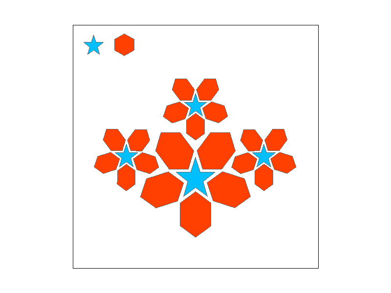
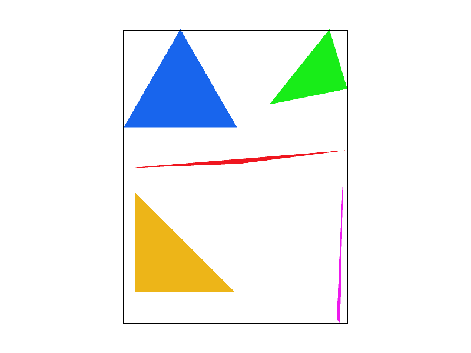
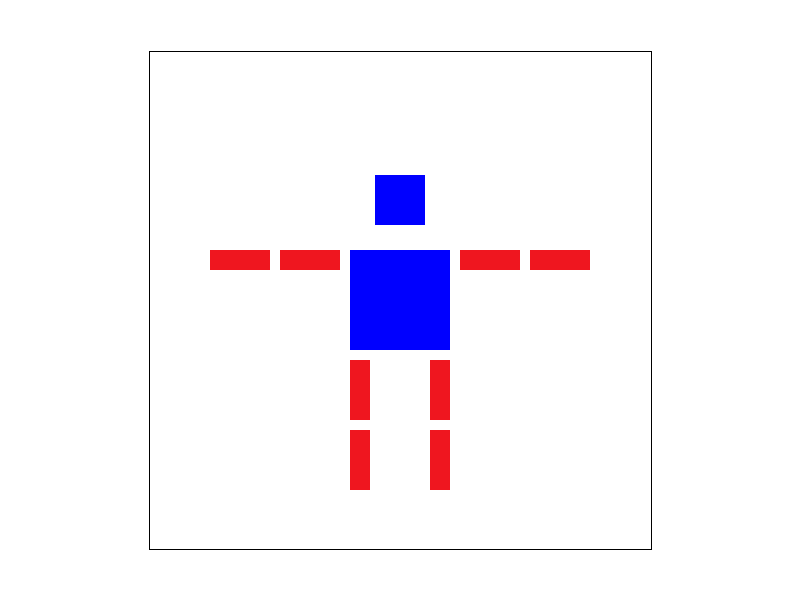

### HW1-task1:Drawing Single-Color Triangles (20 pts)

### Task1-code

### Describtion of algorithm

we set up a bounding box to include the pixels in the loop. And we compute the central of each pixel.For each pixel, it calculates three edge functions, one for each edge of the triangle, to determine on which side of the edge the pixel center lies. Thus the pixel within the triangle will be colored.

### Efficiency Explaination
This approach is efficient because it limits the computation to the pixels within the bounding box, meaning it only performs the necessary tests for potentially affected pixels. In our judgement of three edge function, the computation cost  is similar to directly performing computation of origin method that checks every pixels in the triangle.

### Task1-code
```c++
void RasterizerImp::rasterize_triangle(float x0, float y0,
                                       float x1, float y1,
                                       float x2, float y2,
                                       Color color) {
    float min_X = min(min(x0, x1), x2);
    float max_X = max(max(x0, x1), x2);
    float min_Y = min(min(y0, y1), y2);
    float max_Y = max(max(y0, y1), y2);

    float area = (x1 - x0) * (y2 - y0) - (x2 - x0) * (y1 - y0);
    if (area == 0) return;
    float sign = (area > 0) ? 1.0f : -1.0f;
    for (int x = floor(min_X); x <= floor(max_X); ++x) {
        for (int y = floor(min_Y); y <= floor(max_Y); ++y) {

            float px = x + 0.5f;
            float py = y + 0.5f;

            float dx0 = x1 - x0;
            float dy0 = y1 - y0;
            float L0 = -(px - x0) * dy0 + (py - y0) * dx0;

            float dx1 = x2 - x1;
            float dy1 = y2 - y1;
            float L1 = -(px - x1) * dy1 + (py - y1) * dx1;

            float dx2 = x0 - x2;
            float dy2 = y0 - y2;
            float L2 = -(px - x2) * dy2 + (py - y2) * dx2;

            // Check if the point is inside the triangle
            if (L0*sign >= 0 && L1*sign >= 0 && L2*sign >= 0) {
                fill_pixel(x, y, color);
            }
        }
    }
}
```

### Rasterization Result:




all the images are colored in the triangle.

### Task2 Antialiasing by Supersampling (20 pts)

### supersampling algorithm
Started from Task1,I add supersamping into triangle rasterization. The supersampling can divide a pixel into smaller one for computation. So we can get a detailed photo with fewer jagged edges,More accurate color blending,and more smooth image results.we implemented inner loop for every pixel division and provide sample buffer for pixel color filling.

### modification
We utilize a simpler judgement of triangle for pixel color filling. Then I added two inner(x-ordinate and y-ordinate) of  iterations to provide supersampling in filling color of our loop.


```c++
inline bool in_triangle(float x, float y,
                        float x0, float y0,
                        float x1, float y1,
                        float x2, float y2) {
    // A simple inside-test using barycentric or cross-product approach
    // (There are many ways; pick one you prefer.)

    // Vector cross-product approach:
    float denom = (y1 - y2) * (x0 - x2) + (x2 - x1) * (y0 - y2);
    float L0 = ((y1 - y2) * (x - x2) + (x2 - x1) * (y - y2)) / denom;
    float L1 = ((y2 - y0) * (x - x2) + (x0 - x2) * (y - y2)) / denom;
    float L2 = 1.f - L0 - L1;

    return L0 >= 0 && L1 >= 0 && L2 >= 0 && L0 <= 1 && L1 <= 1 && L2 <= 1;
}

void RasterizerImp::rasterize_triangle(float x0, float y0,
                                       float x1, float y1,
                                       float x2, float y2,
                                       Color color) {
    
    // TODO: Task 2: Update to implement super-sampled rasterization
    float min_x = floorf(min(min(x0, x1), x2));
    float max_x = floorf(max(max(x0, x1), x2));
    float min_y = floorf(min(min(y0, y1), y2));
    float max_y = floorf(max(max(y0, y1), y2));

    int sqrt_sample = (int) floor(sqrt((float) sample_rate));

    for (int px = (int) min_x; px <= (int) max_x; px++) {
        for (int py = (int) min_y; py <= (int) max_y; py++) {
            if (px < 0 || px >= (int) width) continue;
            if (py < 0 || py >= (int) height) continue;

            for (int sample_x = 0; sample_x < sqrt_sample; sample_x++) {
                for (int sample_y = 0; sample_y < sqrt_sample; sample_y++) {
                    float fx = (float) px + ((float) sample_x + 0.5f) / (float) sqrt_sample;
                    float fy = (float) py + ((float) sample_y + 0.5f) / (float) sqrt_sample;

                    if (in_triangle(fx, fy, x0, y0, x1, y1, x2, y2)) {
                        int sample_id = sample_y * sqrt_sample + sample_x;
                        int index = (py * width + px) * sample_rate + sample_id;
                        sample_buffer[index] = color;
                    }
                }
            }
        }
    }
}
```
### we added sample buffer related to sample rate expandsion for fill pixel
```c++
void RasterizerImp::fill_pixel(size_t x, size_t y, Color c) {
    // TODO: Task 2: You might need to this function to fix points and lines (such as the black rectangle border in test4.svg)
    // NOTE: You are not required to implement proper supersampling for points and lines
    // It is sufficient to use the same color for all supersamples of a pixel for points and lines (not triangles)

    if (x >= width || y >= height) return;

    // For points and lines, fill *all* subsamples of this pixel with the same color
    for (int s = 0; s < sample_rate; s++) {
        sample_buffer[(y * width + x) * sample_rate + s] = c;
    }
}
```
# these functions remain the same
```c++
void RasterizerImp::set_sample_rate(unsigned int rate) {
    // TODO: Task 2: You may want to update this function for supersampling support
    this->sample_rate = rate;
    this->sample_buffer.resize(width * height * sample_rate, Color::White);
}


void RasterizerImp::set_framebuffer_target(unsigned char *rgb_framebuffer,
                                           size_t width, size_t height) {
    // TODO: Task 2: You may want to update this function for supersampling support

    this->width = width;
    this->height = height;
    this->rgb_framebuffer_target = rgb_framebuffer;
    this->sample_buffer.resize(width * height * sample_rate, Color::White);
}
```

### supersampling result 





### Explaination of outcome:
In sumpersampling of 1,4,16, we get more-detailed and fewer jagged edges. Due to higher supersampling rate, the pixels have been divided more times to get more block for color filling. we implement more detailed color filling,  so the picture will be skinnyin supersamping 16 than 1.

### Task 3: Transforms (10 pts)

### function translate:
the translate function is a matrix transform by shifting an point by (dx,dy) from the origin  

$$
\begin{bmatrix} 1 & 0 & dx \\ 0 & 1 & dy \\ 0 & 0 & 1 \\ \end{bmatrix}
$$

### function scale
the translate function is a matrix transform by expanding an point by (sx,sy) times from the origin

$$
\begin{bmatrix} sx & 0 & 0 \\ 0 & sy & 0 \\ 0 & 0 & 1 \\ \end{bmatrix}
$$

### function rotate
he translate function is a matrix transform by rotaing an point following the origin by given rads 

$$
\begin{bmatrix} \cos\theta & -\sin\theta & 0 \\ \sin\theta & \cos\theta & 0 \\ 0 & 0 & 1 \\ \end{bmatrix}
$$

### code
```c++
Matrix3x3 translate(float dx, float dy) {
	// Part 3: Fill this in.
	return Matrix3x3(1, 0, dx, 0, 1, dy, 0, 0, 1);

	
}

Matrix3x3 scale(float sx, float sy) {
	// Part 3: Fill this in.
	return Matrix3x3(sx, 0, 0, 0, sy, 0, 0, 0, 1);

	
}

// The input argument is in degrees counterclockwise
Matrix3x3 rotate(float deg) {
	// Part 3: Fill this in.
	double rads = deg * M_PI / 180.0f;
	return Matrix3x3(cos(rads), -sin(rads), 0, sin(rads), cos(rads), 0, 0, 0, 1);
}
```

### Transformation result


Comparing to the image in the web page, we got the correct answers of the manipulation mentioned.


In the picture the robot seemed to be out of power in its head and body, so the robot head rotated and its body and head became blue.
